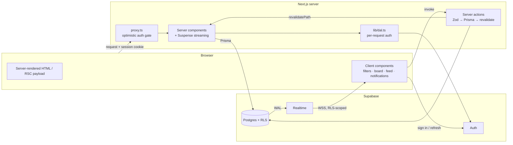

# Architecture

How the Incident Command Center is put together, and why. Each numbered section maps to a point in the assessment's submission requirements.

## 1. Rendering strategy

Server-first. Every route renders on the server as React Server Components; client JavaScript is reserved for interactivity. Three tiers:

- **Static** — `/about-severities` (the severity/status guide) is prerendered at build time (`○` in the build output). It is public, identical for everyone, and never goes stale.
- **Dynamic per request** — everything inside the `(app)` route group (dashboard, projects, incident detail, team). This content is personalized (session, notifications, per-user watch state) and must always be fresh. The group's layout exports `dynamic = "force-dynamic"`, which also keeps `next build` from trying to prerender pages against a database that isn't there at build time.
- **Streamed within the request** — slow sections render behind Suspense boundaries so the page shell arrives immediately (§3).

The dashboard's first paint is pure server HTML: incidents, badges, and stats skeletons are visible before any client JavaScript loads.

## 2. Server and client component boundaries

The default is server; `"use client"` appears only at the interactivity leaves. The rule of thumb applied everywhere: **fetch on the server, mutate through server actions, subscribe on the client.**

- **Server**: pages, layouts, all data access (`features/*/queries.ts` are `server-only`), the incident metadata block, the severity guide, initial feed and notification lists.
- **Client**: filter bar, custom Select/DatePicker, the board's drag-and-drop, live feed + composer, notifications bell, inline editing, the navigation drawer.

Server components fetch with Prisma and pass plain serializable props into client components as **initial data**; clients never re-fetch what the server already delivered — they only *extend* it with realtime events (§4). Mutations go exclusively through server actions in `features/*/actions.ts`, validated with the same Zod schemas the client uses for pre-validation (`features/*/schema.ts` is the shared contract).

## 3. Streaming implementation

Two sections stream after the shell, each behind its own Suspense boundary with a skeleton fallback:

- **Severity stats** on the dashboard render independently from the incident list, so the board is usable while counts are still computing.
- **The activity feed** on the incident detail streams after the incident metadata. The title, status, severity, and assignee are interactive immediately; the feed fills in below.

Both queries carry a deliberate artificial delay (900 ms / 1,200 ms in `features/incidents/queries.ts`) so the streaming behavior is observable during review — remove the two constants to disable.

The feed boundary is additionally wrapped in an error boundary (`feed-error-boundary.tsx`), so a failure in the streamed section degrades to an inline retry card instead of taking down the page. Route-level `loading.tsx` skeletons cover navigation between pages; there is intentionally no full-page spinner.

## 4. Real-time data strategy

Supabase Realtime (`postgres_changes`) over WebSocket, with Postgres RLS deciding what each socket may see:

- **Incident detail** subscribes to that incident's row (status/assignee/title/description/due-date changes), its `incident_updates` inserts, and — on the History tab — `incident_events` inserts. A broadcast channel adds typing indicators.
- **Dashboard** subscribes to `incidents` changes to keep board and table current.
- **Notifications** subscribes to `notifications` inserts filtered to the signed-in user; RLS makes it impossible to receive someone else's rows.

Design decisions:

- The client calls `setAuth()` with the user's access token **before** subscribing, so RLS applies to the socket from the first frame.
- Every subscription is created in a `useEffect` and torn down in its cleanup; channels are removed on unmount and re-created when auth changes.
- Realtime events **merge** into server-rendered initial data with id-based dedupe — an event that later arrives again via a server revalidation is not duplicated.
- Feedback is asymmetric on purpose: your own mutations confirm with a toast; other people's activity updates the UI silently (badge counts, live feed, `aria-live` announcements) so remote users can't spam your screen with toasts.

## 5. Authentication strategy

Supabase Auth with SSR cookies (`@supabase/ssr`), verified in two layers:

1. **`proxy.ts` — optimistic gate.** Runs before any HTML is produced: refreshes the session cookie, redirects signed-out visitors to `/login?redirectTo=…` (preserving path + query), and bounces signed-in users away from `/login`. Because the redirect happens at the edge of the request, protected content is never flashed to unauthenticated users.
2. **`lib/dal.ts` — real authorization.** The proxy is only routing; every protected page and every server action independently verifies the session via `getUser()` (wrapped in React `cache()` so the check runs once per request, not once per call site). Server actions return friendly errors when the session has expired rather than leaking backend errors.

Sessions survive refreshes via cookies; the proxy transparently refreshes expired access tokens.

There is deliberately **no self-service registration**: an incident tool is membership-driven, so user provisioning is seed/invite-based — an open sign-up would create orphan accounts with no organization, projects, or team. The login page instead surfaces the demo accounts so reviewers can explore instantly, including the multi-user realtime behavior with two browsers side by side.

## 6. Caching and invalidation decisions

| Content | Strategy | Invalidation |
|---|---|---|
| Severity guide | Static at build | Redeploy (content is code) |
| Dashboard / projects / detail / team | Dynamic per request | `revalidatePath` after every mutation |
| Duplicate reads within one request | React `cache()` around queries (`getIncident`, `getProfiles`, `getOrganization`…) | Scoped to the request — no cross-request staleness possible |
| Client router cache | Default Next.js behavior + `loading.tsx` skeletons | `router.refresh()` where realtime events must re-sync server HTML |
| Realtime data | Not cached — pushed | The push *is* the invalidation |

The deliberate choice was to keep cross-request caching **off** for incident data: operational data is exactly the kind where a stale cache is worse than a slower response. Freshness is instead achieved cheaply through per-request dedupe (`cache()`), streaming (§3), and realtime push (§4). Avoiding double-fetching between server and client falls out of the same rule: the server fetches once, clients receive props and only subscribe to deltas.

## 7. Hydration risks and mitigations

The risk considered most carefully: **time-dependent rendering.**

- **Relative timestamps** ("3 minutes ago") differ between the server render and the client render by definition. `TimeAgo` renders a timezone-stable absolute UTC string on the server and swaps to the relative form only after mount (`useState(null)` + `useEffect`), then re-renders every minute. Server HTML and first client render are identical — no mismatch, and no `suppressHydrationWarning` papering over one.
- **The navbar greeting** ("Good night" + moon icon) depends on the local clock, which the server cannot know. The server renders just the name; greeting and icon appear after mount, hydration-safe by construction.
- **Due-date day-shift**: due dates are stored at **noon UTC** and compared as `yyyy-mm-dd` strings against the viewer's local date, so a date never renders as a different day (or flips to "overdue") depending on timezone.
- **Viewport-dependent UI** (sidebar vs. mobile drawer, toast position) is CSS-only (Tailwind breakpoints), never a JS media query read before hydration.
- **Auth state** has a single source — the server-verified session — passed down as props. The client never derives its own auth state during initial render.

## 8. State-management decisions

No global state library — each kind of state lives in the smallest tool that owns it:

| State | Lives in | Example |
|---|---|---|
| Server state | RSC props, refreshed via `revalidatePath` | Incident lists, detail metadata |
| URL state | `searchParams` | Filters, search query, board/table view — shareable and refresh-proof |
| Form state | Uncontrolled forms + server action results; Zod on both sides | Login, new incident, composer |
| Optimistic state | `useOptimistic` / `useTransition` | Status drag, inline edits, feed posts — auto-revert on server rejection |
| Local component state | `useState` | Open menus, search expansion, drafts |
| Auth state | Supabase session cookie (server-verified) | — |
| Realtime data | Channel subscriptions merged into initial props | Feed, notifications, board updates |

`useOptimistic` was chosen over manual rollback bookkeeping because reverting is automatic: when the transition ends without a successful revalidation, React discards the optimistic value and the UI settles back to the last server truth.

## 9. Known limitations

- **Single organization.** The schema is org-ready (organizations, memberships, per-org projects) but the UI assumes one org; there is no org switcher or invitation flow.
- **No pagination or virtualization.** Boards, feeds, and the audit log load fully; fine for hundreds of incidents, not thousands.
- **Authorization is membership-level.** The admin role is displayed but not yet enforced as a permission boundary; any member can edit any incident.
- **Realtime reconnection is delegated** to supabase-js defaults (retry with backoff). There is no offline mutation queue; the live badge reflects connection state but pending edits during an outage fail rather than queue.
- **The E2E flows were verified with Playwright scripts** during development, but only the Vitest suite ships in the repo — CI runs lint, `tsc` and Vitest before the image is built, yet nothing exercises a real browser there.
- **Artificial streaming delays** (§3) are still in place for demonstrability.

## 10. What I would improve with more time

1. **Committed Playwright E2E suite** (multi-context realtime tests included) wired into the existing CI gate, which today runs lint, `tsc` and Vitest before the Docker image is built.
2. **Cursor-based pagination + virtualized lists** for feeds and boards, and moving dashboard filtering server-side behind an index once data grows.
3. **Role-based authorization** enforced in server actions and RLS (admin vs. member), plus per-project membership.
4. **Presence** (who is viewing this incident) via Supabase presence channels, and draft preservation for unsent updates.
5. **Observability**: Core Web Vitals are already collected with Next's native `useReportWebVitals` (`features/observability/web-vitals-reporter.tsx`, logged as structured `console.debug` entries). The next step is shipping them from that single callback to a RUM backend — Datadog RUM correlated with APM, or Sentry — plus frontend error tracking wired to the existing error boundaries.
6. **Multi-organization support**: org switcher, invitations, and scoping every query by the active org id already present in the schema.
